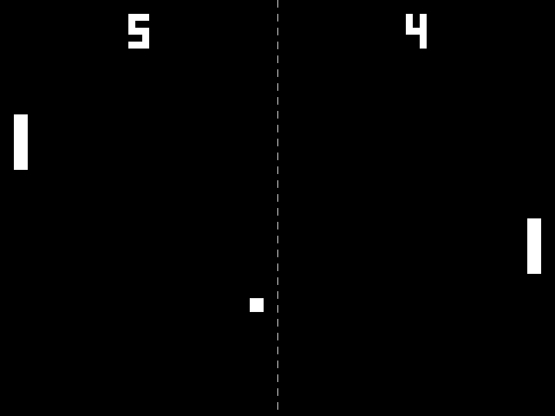

# gawk-sdl2


> 🎮 SDL2 bindings for gawk

## Description

**gawk-sdl2** provides a shared library extension for gawk to use the SDL2 library.



> [!NOTE]
> This is an experimental project with a very limited number of available functions. Additionally, due to gawk storing all numbers as double-precision floating point numbers, it may not function properly on 64-bit systems.

## Requirements

- [GNU awk](https://www.gnu.org/software/gawk/) (&gt;= 4.2.1)
- [SDL 2.0](https://github.com/libsdl-org/SDL/tree/SDL2) headers and libraries
- [SDL_mixer 2.0](https://github.com/libsdl-org/SDL_mixer/tree/SDL2) headers and libraries

## Installation

### Install the Build Dependencies

```shell
# Debian-based distributions
sudo apt install build-essential
sudo apt install libsdl2-dev libsdl2-mixer-dev

# Fedora-based distributions
sudo dnf groupinstall "Development Tools" "Development Libraries"
sudo dnf install SDL2-devel SDL2_mixer-devel

# Arch-based distributions
sudo pacman -S base-devel
sudo pacman -S sdl2 sdl2_mixer
```

### Clone the Repository

```shell
git clone https://github.com/mikkun/gawk-sdl2.git
```

### Build the Extension

```shell
cd gawk-sdl2
make
```

### Run the Example

```shell
cd examples
AWKLIBPATH=.. ./pong.awk
```

## Usage

See `examples/*.awk` for usage.

## Implemented Functions

🚧 Functions are being implemented as needed. The functions currently implemented are as follows:

### SDL 2.0

- `SDL_AllocFormat`
- `SDL_AllocPalette`
- `SDL_BlitSurface`
- `SDL_CreateRGBSurface`
- `SDL_CreateRGBSurfaceWithFormat`
- `SDL_CreateRenderer`
- `SDL_CreateTexture`
- `SDL_CreateTextureFromSurface`
- `SDL_CreateWindow`
- `SDL_Delay`
- `SDL_DestroyRenderer`
- `SDL_DestroyTexture`
- `SDL_DestroyWindow`
- `SDL_FillRect`
- `SDL_FreeFormat`
- `SDL_FreePalette`
- `SDL_FreeSurface`
- `SDL_Gawk_AllocColorPalette`
- `SDL_Gawk_AllocEvent`
- `SDL_Gawk_AllocRect`
- `SDL_Gawk_GetEventType`
- `SDL_Gawk_GetKeyboardState`
- `SDL_Gawk_GetPixelColor`
- `SDL_Gawk_PixelFormatEnumToArray`
- `SDL_Gawk_PixelFormatToArray`
- `SDL_Gawk_SetPixelColor`
- `SDL_Gawk_SurfaceToArray`
- `SDL_Gawk_UpdateColorPalette`
- `SDL_Gawk_UpdateRect`
- `SDL_GetError`
- `SDL_GetPixelFormatName`
- `SDL_GetTicks`
- `SDL_GetWindowPixelFormat`
- `SDL_GetWindowSurface`
- `SDL_HasIntersection`
- `SDL_Init`
- `SDL_InitSubSystem`
- `SDL_MapRGBA`
- `SDL_MasksToPixelFormatEnum`
- `SDL_PollEvent`
- `SDL_Quit`
- `SDL_QuitSubSystem`
- `SDL_RenderClear`
- `SDL_RenderCopy`
- `SDL_RenderDrawLine`
- `SDL_RenderDrawRect`
- `SDL_RenderFillRect`
- `SDL_RenderPresent`
- `SDL_SetPaletteColors`
- `SDL_SetRenderDrawColor`
- `SDL_SetSurfacePalette`
- `SDL_SetWindowTitle`
- `SDL_ShowSimpleMessageBox`
- `SDL_UpdateTexture`
- `SDL_UpdateWindowSurface`
- `SDL_VERSIONNUM`

### SDL_mixer 2.0

- `Mix_AllocateChannels`
- `Mix_CloseAudio`
- `Mix_FreeChunk`
- `Mix_FreeMusic`
- `Mix_Gawk_Linked_Version`
- `Mix_Gawk_QuerySpec`
- `Mix_GetError`
- `Mix_HaltChannel`
- `Mix_HaltMusic`
- `Mix_LoadMUS`
- `Mix_LoadWAV`
- `Mix_OpenAudio`
- `Mix_PlayChannel`
- `Mix_PlayChannelTimed`
- `Mix_PlayMusic`
- `Mix_Playing`
- `Mix_PlayingMusic`
- `Mix_SetDistance`
- `Mix_SetMusicCMD`
- `Mix_SetMusicPosition`
- `Mix_SetPanning`
- `Mix_SetPosition`
- `Mix_SetReverseStereo`
- `Mix_VolumeMusic`

## TODO

- Implement more functions.

## License

[GNU General Public License v3.0 or later](./LICENSE)

## Author

[KUSANAGI Mitsuhisa](https://github.com/mikkun)

## References

- [Dynamic Extensions (The GNU Awk User’s Guide)](https://www.gnu.org/software/gawk/manual/html_node/Dynamic-Extensions.html)
- [SDL2/FrontPage - SDL Wiki](https://wiki.libsdl.org/SDL2/FrontPage)
- [SDL2_mixer/FrontPage - SDL Wiki](https://wiki.libsdl.org/SDL2_mixer/FrontPage)
